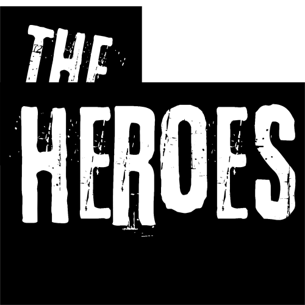

# The Heroes

Welcome to **The Heroes**! This is an open-source project that showcases a website of superheroes and characters from both the Marvel and Star Wars universes, leveraging the Marvel API and Star Wars API, and built using the Vite framework. This project is created for the HackClub Arcade.

## Table of Contents

- Introduction
- Features
- Installation
- Usage
- Contributing
- License
- Acknowledgements

## Introduction

**The Heroes** is a web application that allows users to explore various superheroes from the Marvel universe and characters from the Star Wars universe. The project aims to provide a fun and interactive way to learn about different characters, their powers, and their stories.

## Features

- **Marvel API Integration**: Fetches data about superheroes directly from the Marvel API.
- **Star Wars API Integration**: Fetches data about characters directly from the Star Wars API.
- **Responsive Design**: Optimized for both desktop and mobile devices.
- **Search Functionality**: Easily search for your favorite superheroes and Star Wars characters.
- **Detailed Information**: View detailed information about each character, including their powers, history, and more.

## Installation

To get started with the project, follow these steps:

1. **Clone the repository**:
    ```bash
    git clone https://github.com/radhaya9av/the-heroes.git
    cd the-heroes
    ```

2. **Install dependencies**:
    ```bash
    npm install
    ```

3. **Set up Marvel and Star Wars APIs**:
    - Obtain your API keys from the Marvel Developer Portal and Star Wars API.
    - Create a `.env` file in the root directory and add your API keys:
        ```env
        VITE_MARVEL_PUBLIC_KEY = "your_marvel_api_key_here"
        VITE_MARVEL_PRIVATE_KEY = "your_marvel_api_key_here"
        VITE_STARWARS_API_KEY = "your_starwars_api_key_here"
        ```

4. **Run the development server**:
    ```bash
    npm run dev
    ```

## Usage

Once the development server is running, you can access the application at `http://localhost:3000`. Use the search bar to find your favorite superheroes and Star Wars characters and explore their profiles.

## Contributing

We welcome contributions from the community! If you'd like to contribute, please follow these steps:

1. **Fork the repository**.
2. **Create a new branch**:
    ```bash
    git checkout -b feature/your-feature-name
    ```
3. **Make your changes**.
4. **Commit your changes**:
    ```bash
    git commit -m "Add your commit message"
    ```
5. **Push to the branch**:
    ```bash
    git push origin feature/your-feature-name
    ```
6. **Create a Pull Request**.

## License

This project is licensed under the MIT License. See the LICENSE file for more details.

## Acknowledgements

- Thanks to Marvel for providing the API.
- Thanks to Star Wars API for providing the data.
- Special thanks to HackClub Arcade for the inspiration and support.

---

Happy coding! If you have any questions or need further assistance, feel free to reach out.